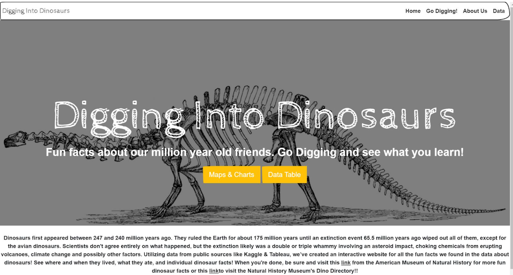
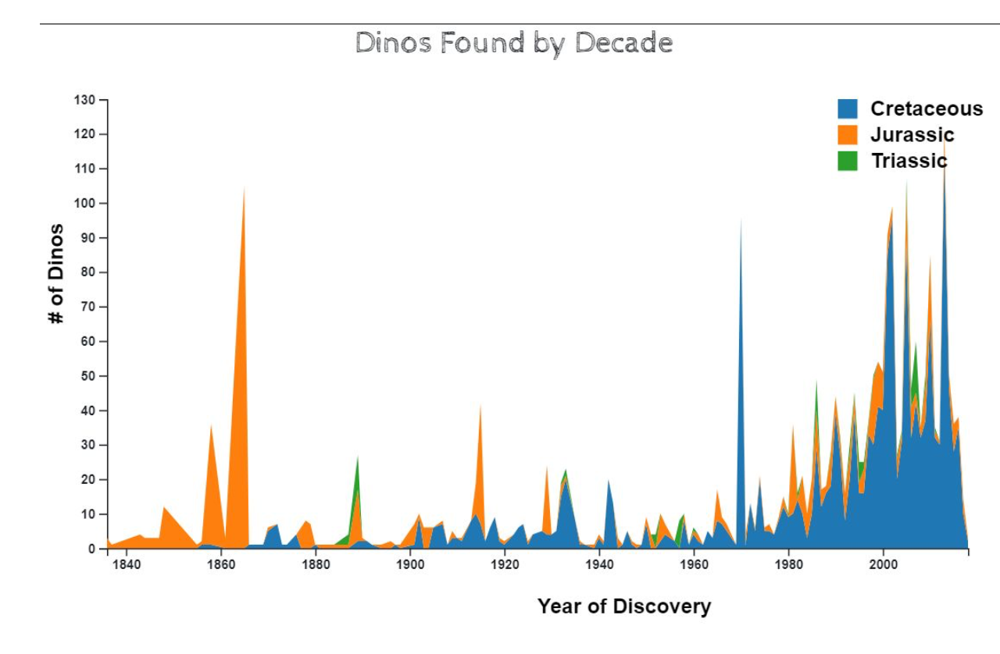
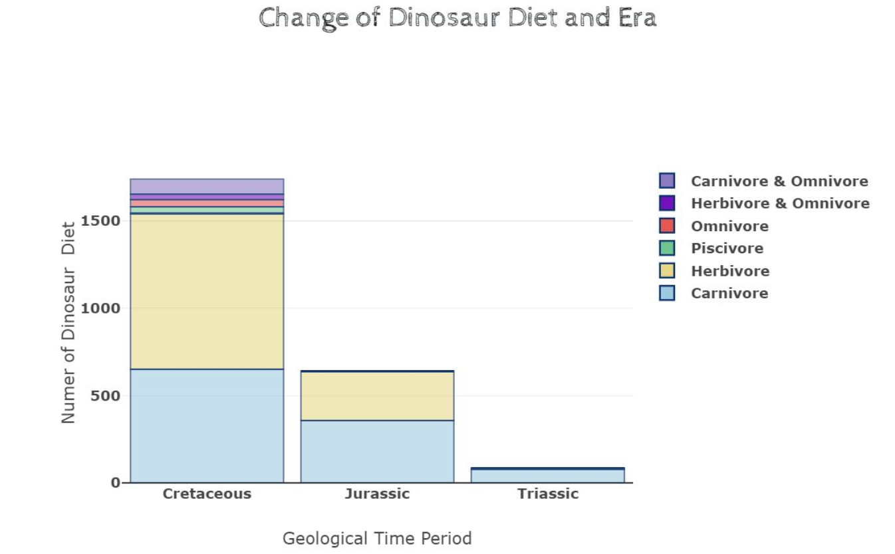

# voyage-project-tier1-dinosaurs

## Table of Contents

* [Overview](#overview)
* [General Instructions](#general-instructions)
* [Requirements & Specifications](#requirements-specifications)
* [Acknowledgements](#acknowledgements)
* [About Chingu](#about-chingu)

## Overview

Hey there! How about we create an app all about dinosaurs? We've got our data all 
set from the National History Museum that tells us about different dinosaurs.

Imagine our app like a dino world! We can show all kinds of dinosaurs – big ones 
looking for food, calm ones eating plants, and even tiny ones running around. From 
huge dinosaurs that made the ground shake to little ones in the forests.

And get this, our tool might even let us time-travel! Imagine going back in time to 
see how these dinosaurs lived. Plus, it tells us what type of dinosaur it is and 
where it used to call home. So, you'll get to know dinosaurs from all over the place.

We're thinking of adding a cool twist – using News data to show you the latest 
discoveries about dinosaurs. Pretty cool, huh?

Let's make an app that's not just smart but also super fun for everyone!

- Dinosaur example website

- Dinosaurs example map

- Dinosaurs example charts

Your Chingu Voyage team will be using this data to create an web app that will help 
anyone interested to be able to “dig” into the fossil data and discover facts 
about dinosaurs in a unique way. Your app will summarize this data and will allow
users to apply a single filter to multiple visualizations simultaneously.

This will provide you with an opportunity to build Web Development experience
dealing with large volumes of dinosaurs & news data, charts, maps, and user queries.

## General Instructions

This project is designed to be worked on by a team rather than an individual
Chingu. This means you and your team will need to thoroughly read and
understand the requirements and specifications below, **_and_** define and
manage your project following the _Agile Methodology_ defined in the
[Voyage Handbook](https://github.com/chingu-voyages/Handbook/blob/main/docs/guides/voyage/voyage.md#voyage-guide).

As you create this project make sure it meets all of the requirements, but once
it reaches MVP, start implementing the optional features or get creative and
extend it in ways we haven't envisioned. In other words, use the power of
teamwork to make it distinctive and unique.

Take note that we haven't given specific direction on what your UI/UX should
look like. This is another area where you and your team can put your creativity 
to work! 

## Requirements & Specifications

### What You Need to Do

The following define the minimum requirements and ideas for features you may
implement to enhance this app, if time permits.

#### Structure

- [ ] This is a purely frontend application. No backend is required. 
- [ ] You may use any languages, tools, or libraries you prefer when designing and building this app. 
- [ ] We've included a JSON file containing the raw data in the `/assets` directory in this repo. But, 
if you choose, you may use the [Dinosaurs API](https://chinguapi.onrender.com/dinosaurs) instead.
- [ ] You may **_NOT_** use AI-base solution generators like GitHub CoPilot.
- [ ] Useful links and resources:
    - [National History Museum](https://www.nhm.ac.uk/discover/dinosaurs.html)
    - [Dinosaurs API](https://chinguapi.onrender.com/dinosaurs)
    - [NewsAPI](https://newsapi.org)

#### Styling

- [ ] Surprise us!!! Use your teams creativity to make this app distinctive.
- [ ] Add a footer containing a link to your teams GitHub repo
- [ ] In general, you will find these [UI design principles](https://www.justinmind.com/ui-design/principles) helpful.
- [ ] Recommend using this resource for [clean CSS](https://www.devbridge.com/articles/implementing-clean-css-bem-method/)

#### Functionality

-   Overview:
    - [ ] A single page application (SPA) or it's equivalent design to provide users with an immersive experience in exploring dinosaurs through a user-friendly interface.

- Dinosaur Display
    - [ ] Display dinosaurs' names and corresponding images sourced from the provided JSON file.
    - [ ] Each dinosaur entry should be clickable to view full details.

- Search Component
    - [ ] Implement a search feature allowing users to search for dinosaurs by name.
    - [ ] Search results should dynamically filter displayed dinosaurs based on the entered name.

- Diet Chart Visualization
    - [ ] Display a chart (pie chart or doughnut chart) illustrating the distribution of general dinosaur diets (e.g., herbivore, carnivore, omnivore) based on provided JSON data.
    - [ ] Ensure the chart is visually appealing and informative, providing a clear overview of diet composition.

- Dinosaur Details View
    - [ ] Enable users to view full details of a selected dinosaur upon clicking its entry.
    - [ ] Details should include additional information sourced from the JSON file such as: 
        - name
        - imageSrc
        - typeOfDinosaur
        - length
        - diet
        - whenLived
        - typeSpecies
        - description

- Responsiveness
    - [ ] Ensure the web application is responsive and accessible across various devices and screen sizes.
    - [ ] Utilize responsive design techniques to adapt to different viewport sizes.
    
### Extras (Not Required)

- Dinosaur Location Map
    - [ ] Provide an optional feature to display the location of a selected dinosaur on a map.
    - [ ] Upon clicking a dinosaur entry, dynamically fetch and display its geographic location on an interactive map using a mapping API (e.g., Google Maps).

## Acceptance Criteria
- Search Functionality
    - [ ] Users should be able to search for dinosaurs by name.
    - [ ] Search results must dynamically filter displayed dinosaurs based on the entered name.
    - [ ] Search functionality should be case-insensitive and allow partial matching of dinosaur names.

- Diet Chart Visualization
    - [ ] The app must display a chart (pie chart or doughnut chart) illustrating the distribution of general dinosaur diets (e.g., herbivore, carnivore, omnivore) based on provided data.
    - [ ] The chart must accurately represent the proportion of each diet type within the dataset.
    - [ ] Users should be able to easily interpret and interact with the chart to understand diet composition.

- Dinosaur Details View
    - [ ] Upon clicking a dinosaur entry, users must be able to view full details of the selected dinosaur.
    - [ ] Dinosaur details should include notable characteristics sourced from the JSON file.
    - [ ] The details view should be accessible and provide comprehensive information about the selected dinosaur.

## Acknowledgements

We acknowledge the [National History Museum](https://www.nhm.ac.uk) for providing access to the dataset containing valuable information about dinosaurs. Additionally, we thank [NewsAPI](https://newsapi.org) for delivering the latest news on dinosaur discoveries, contributing to our ongoing exploration of this fascinating field.

## About Chingu

If you aren’t yet a member of Chingu we invite you to join us. We help our 
members transform what they’ve learned in courses & tutorials into the 
practical experience employers need and want.